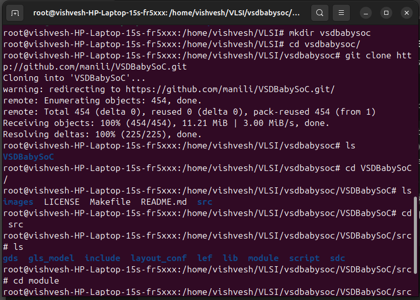
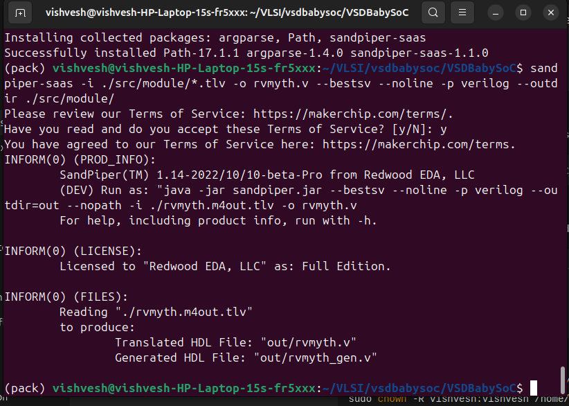
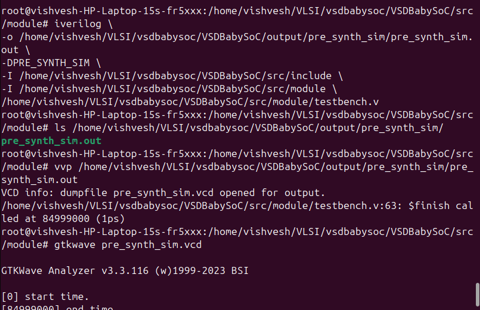
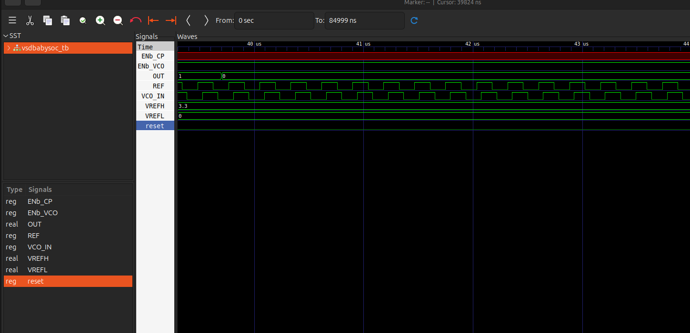

## presynthesis simulation of vsdbabysoc

steps

step1: creating a directorv for the vsdbabysoc and cloning the git file

step2: creating a python virtual environment 

installing the required pyyaml,sandpiper and converting it to the verilog file using sandpiper

step3: running the presynthesis simultion for the example file and generating the output vcd file 

and visualing thrpugh gtk

