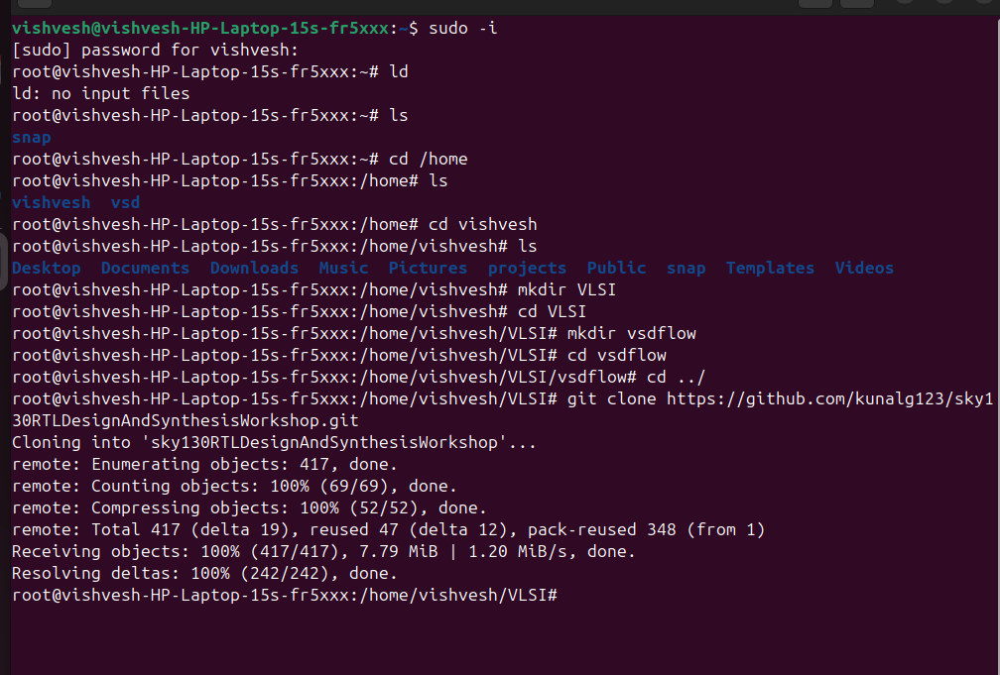
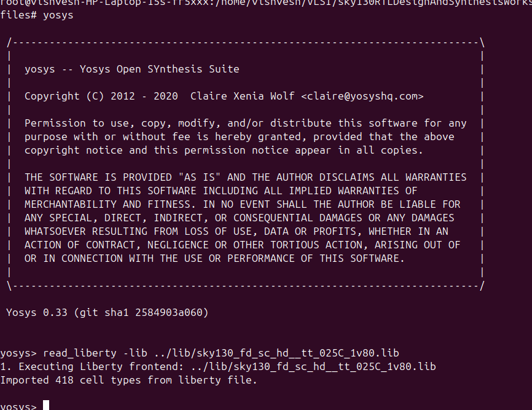

# Week 1, Day 1: Verilog Simulation and Logic Synthesis

In the First day of our workshop we have been dives into the fundamentals of digital design using open-source tools.

---

## 1. Introduction to Open-Source Verilog Simulators

**What is Verilog?**
Verilog is a Hardware Description Language (HDL) used to model electronic systems. It allows us to describe a digital circuit's design and behavior, which can then be tested (simulated) and built (synthesized).

**Our Toolchain:**
For this lab, we will use two primary open-source tools for simulation:
* **Icarus Verilog (`iverilog`):** This is a Verilog compiler and simulator. It takes our Verilog files as input, compiles them into an executable format, and runs the simulation.
* **GTKWave:** This is a waveform viewer. After running a simulation, `iverilog` generates a waveform dump file (usually a `.vcd` file). GTKWave allows us to open this file and visually inspect the signals in our circuit over time, which is crucial for debugging.

***

***

---

## 2. Lab using `iverilog` and `GTKWave`

In this lab, i  have been simulated a ripple counter.

The design and testbench of the ripple counter

The output vcd file opened in the gtk wave

---
## 3. Introduction to Yosys and Logic Synthesis

The yosys is invoked and libraries are configured

The output netlist generated in the yosys

## 4. Labs using Yosys and Sky 130 pdks

The written verilog file after generated through yosys netlist
 

