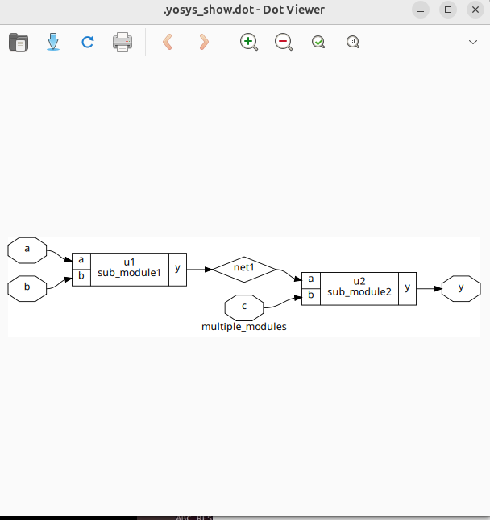
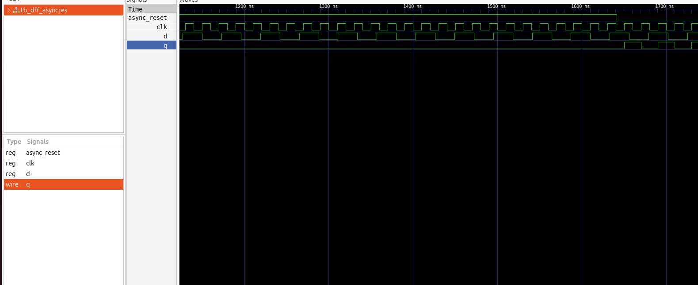

## WEEK1 Day2 Timing libs,hierarchial vs flat synthesis and efficient flop coding styles

## introduction to timing.libs

A .lib file is structured as a series of nested blocks. Here are the key components:

1. The Library Header

The file begins with a header that defines global parameters, such as:

    Technology: The manufacturing process (e.g., CMOS 130nm).

    Units: The units for time, voltage, current, and capacitance (e.g., 1ns, 1V).

    Operating Conditions: The Process, Voltage, and Temperature (PVT) corner at which the library was characterized (e.g., tt_025C_1v80 for typical process, 25°C, 1.8V).

## hierarchial vs flat synthesis
When managing large designs, we also make a strategic choice in methodology—employing hierarchical synthesis to preserve our modular structure for faster compile times and easier debugging, or flat synthesis for smaller blocks to achieve maximum cross-boundary optimization.

## hierarchial example or hier view

## Various flop coding styles and optimizations

The various flop coding styles are based on the asynchronous, synchronous reset and set

an example for the asynchronous reset dff
